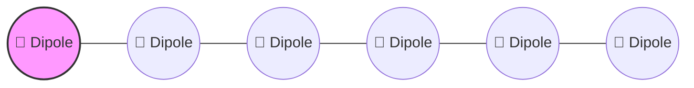

# 📡 Antenna Array Design Projects  

This repository contains design specifications and layouts for two antenna array configurations developed for **1 GHz operation**. Both projects focus on dipole-based arrays with optimized spacing for broadside radiation.  

---

## 🔹 [Project 1: Uniform Linear Array (ULA) with 6 Elements](https://github.com/SarvagyaSanjay/Electronics-Project/blob/main/CST%20Studio_Antenna%20Design/antenna_array.pdf)
 
### 🛠️ Design Specifications  

| Parameter              | Value                     |
|------------------------|---------------------------|
| **Element Type**       | Dipole antenna            |
| **Number of Elements** | 6                         |
| **Element Spacing**    | 0.5 λ (half wavelength)   |
| **Operating Frequency**| 1 GHz                     |
| **Configuration**      | Broadside                 |

### 📊 Array Layout  


---

## 📡 🔹 [Project 2: 7-Element Dipole Antenna Array](https://github.com/SarvagyaSanjay/Electronics-Project/blob/main/CST%20Studio_Antenna%20Design/antenna_7array.pdf)

A project involving the design and simulation of a **7-element dipole antenna array** with optimized spacing and feed gap, aimed at achieving efficient radiation at **1 GHz**.  

---

## 🔧 Antenna Specifications  

| Parameter              | Value                |
|------------------------|----------------------|
| Antenna Type           | Dipole               |
| No. of Elements        | 7                    |
| Centre Frequency       | 1 GHz                |
| Element Length         | 143 mm               |
| Feed Gap               | 20 mm                |
| Element Spacing        | λ/2 = 300 mm         |
| Dipole Material        | PEC (Perfect Electric Conductor) |
| Surrounding Medium     | Vacuum               |
| Outer Radius           | 4 mm                 |

---

## 🎯 Design Highlights  

- ✅ **7 dipole elements** placed with λ/2 spacing for optimal array performance  
- ✅ **PEC material** used for dipole design to minimize conductor losses  
- ✅ Operates at **1 GHz centre frequency** with 143 mm dipole length  
- ✅ Designed feed gap of **20 mm** for stable excitation  

---

## 📊 Array Layout  

```mermaid
graph LR
  D1[📡 Dipole 1] --- D2[📡 Dipole 2] --- D3[📡 Dipole 3] --- D4[📡 Dipole 4] --- D5[📡 Dipole 5] --- D6[📡 Dipole 6] --- D7[📡 Dipole 7]

