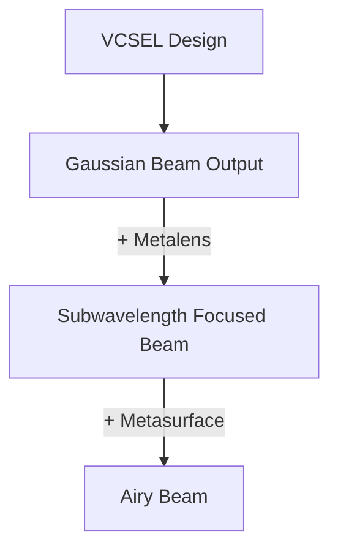

# 🔬 Surface Enhanced VCSEL (Capstone Project)

## 📖 Project Overview
The **Surface Enhanced VCSEL (Vertical-Cavity Surface-Emitting Laser)** project is a research-driven photonics capstone aimed at designing advanced optical systems.  
The project focuses on generating **Airy beams with subwavelength focusing** using **VCSEL design, metalenses, and metasurfaces**. This work explores the frontier of **beam shaping and optical manipulation** with potential applications in **optical communication, biomedical imaging, and advanced photonic devices**.

---

## ✨ Key Highlights
- 📡 **VCSEL Simulation**: Designed a Gaussian beam output from a custom VCSEL structure.  
- 🔍 **Metasurface & Metalens Integration**: Enhanced beam shaping for **subwavelength focusing**.  
- 🌊 **Airy Beam Generation**: Leveraged engineered metasurfaces to produce **non-diffracting Airy beams**.  
- ⚙️ **Simulation Tools**: Involved in modeling, beam propagation analysis, and optical structuring.

---

## 📊 Block Diagram (Mermaid)

---
---

## 📄 Documentation
For detailed methodologies, simulation parameters, and technical insights, refer to the project documentation in this folder.

---

🚀 *This capstone project represents a blend of advanced optics and practical simulation work — pushing the boundaries of what’s possible with VCSEL-based photonics.*
